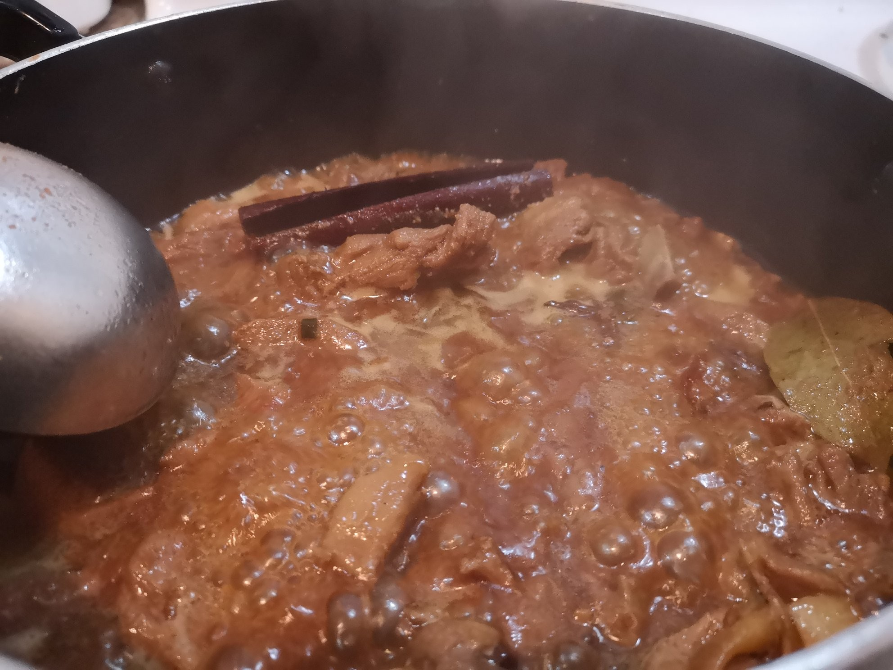
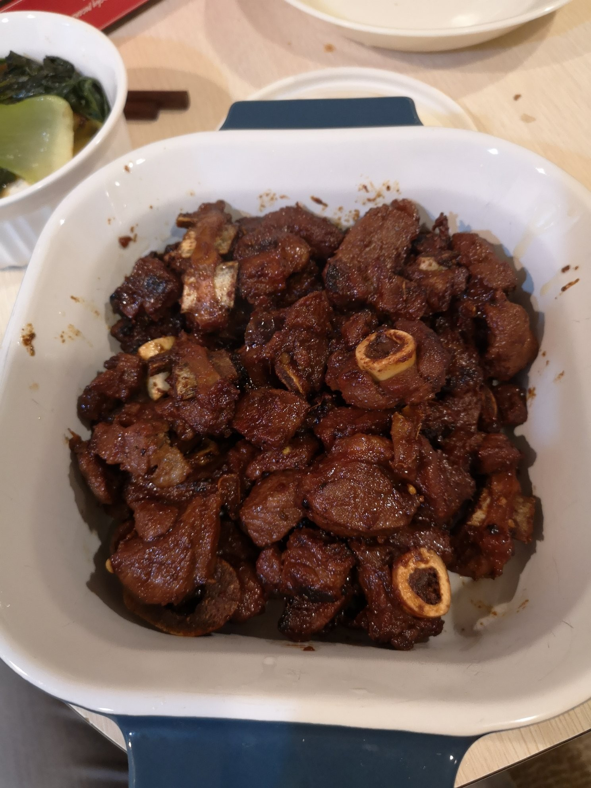

# Orange's Braised Lamb

## Ingredients

### Fresh
* (3 lbs) Lamb, doesn't matter which part
* (about 5g sliced) Ginger
* (about 5g sliced) Garlic

### Spices
* (1 pc) Cinnamon stick
* (2 pc) Bay leaf
* (2 pc) Star anise
* (1 tsp) Dried hot chili peppers

### Sauces and etc.
* (1/3 cc) Soy sauce
* (1 tbsp) Cooking wine (mirin, sake, wine, Shaoxin etc.)
* (2 tbsp) Sugar (can use honey, brown sugar)
* (3 tsp) Salt
* (1 cc) Water
* (2 tbsp) Cooking oil

1. Cut lamb into bite-sized cubes and place the lamp and half of the sliced ginger into a pot
2. Fill the pot enough to cover the lamb
3. Cook on high heat until boiling and immediately remove from heat
4. Drain pot and wash the lamb in cold water
5. In a clean pot, head up the oil with garlic, hot peppers and the remaining ginger
6. Once the oil is fragrant put the lamb into the pot and stir fry for 3 minutes
7. Put cooking wine, soy sauce, sugar, salt, 1 cc water and all of the spices into the pot and cook on medium-high heat until the sauce is very reduced (approx 35 minutes)

### Finished product!

