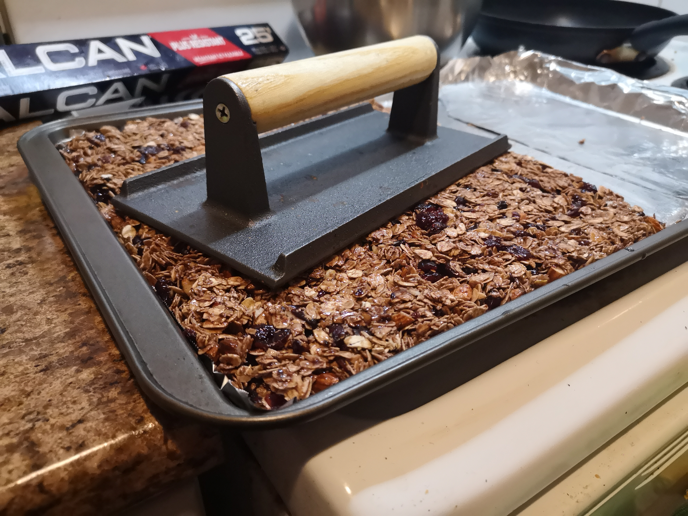

# Cocoa-Cranberry Granola Bar

## Ingredients

### Fresh
* (1/2 cc) Unsalted butter (can exchange parts with coconut oil)
* (1/3 cc) Honey
* (1/4 cc) Brown sugar (can sub with white)
* (1/2 tsp) Vanilla extract
* (1/4 tsp) Salt

### Dry
* (2 1/2 cc) Rolled oats
* (1/2 cc) Whole almonds, coarsely chopped
* (1/2 cc) Dried cranberries, coarsely chopped
* (1 1/2 tbsp) Cocoa powder

## Instructions
1. Preheat oven to 350 degrees Fahrenheit
2. In a sauce pan, over medium-low heat melt all the fresh ingredients together until butter has melted, stirring constantly
3. In a large bowl, mix dry and melted fresh ingredients together, toss until homogeneous
4. In a large baking tray at least 9-inch slightly greased, spread granola mixture evenly and press down firmly with spatula to pack the oats (I used a steak press)
5. Bake for 8-10 minutes 
6. Refrigerate for at least 2 hours before cutting into 2-inch by 1-inch bars

### Finished!

